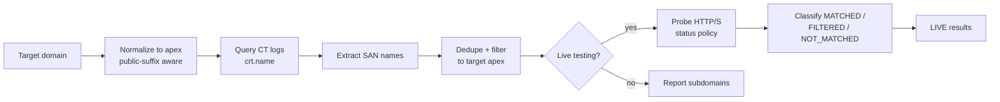

<div align="center">

# 🔍 CTProbe

**Certificate Transparency Subdomain Enumeration & HTTP/S Reconnaissance**

[](https://github.com/Debajyoti0-0/CTProbe/blob/main/LICENSE)
[](https://www.python.org/downloads/)
[]()
[]()

*Enumerate certificate-derived subdomains of any apex domain and probe their
HTTP/S reachability — fast, fail-closed, and protocol-aware.*

[Quick Start](#-quick-start) · [Usage](#usage) · [Options](#common-options) · [Examples](#example-workflows)

</div>

<p align="center">

</p>

> ⚠️ **Authorized use only.** CTProbe is intended for **authorized** security
> assessments and OSINT reconnaissance. It is **not** an anonymity tool:
> `--stealth` lowers request rate and concurrency; it does not make traffic
> anonymous or undetectable.

## ✨ Features

| Category | Capabilities |
|----------|-------------|
| **Discovery** | Query Certificate Transparency logs (crt.name), extract & normalize SAN entries, public-suffix-aware apex filtering |
| **Live Testing** | HTTP/1.1 · HTTP/2 · HTTP/3 with capability-aware negotiation, bounded-concurrency async engine (aiohttp) |
| **Routing** | Fail-closed HTTP/SOCKS4/4a/5/5h proxy support, verified Tor routing (`IsTor` confirmed before scan) |
| **Stealth** | Low-rate mode with randomized delays, reduced concurrency, respectful retry behavior |
| **Analysis** | Status-code match/filter policies, heuristic threat scoring, structured error classification |
| **Output** | TXT · JSON · XLSX, custom filenames/directories, color-free files |

## 🚀 Quick Start

```bash
git clone https://github.com/Debajyoti0-0/CTProbe.git
cd CTProbe

pip install -r requirements.txt

# Enumerate subdomains of example.com
python -m ctprobe example.com --no-live
```

### Optional Extras

```bash
pip install 'httpx[http2]'    # HTTP/2 support
pip install openpyxl          # XLSX output
```

HTTP/3 requires a curl binary built with HTTP/3 support.

<details>
<summary><b>Debian / Kali packaging</b></summary>

```bash
sudo apt install build-essential debhelper dh-python pybuild-plugin-pyproject \
                 python3-all python3-setuptools
dpkg-buildpackage -us -uc
sudo dpkg -i ../ctprobe_1.0.0-1_all.deb
```

</details>

## 📖 How It Works



1. **Input normalization** — a full URL or deep subdomain is reduced to the registrable apex.
2. **CT query** — certificates issued under the apex are fetched from crt.name.
3. **SAN extraction** — DNS names are lowercased, wildcards/trailing dots stripped, deduplicated.
4. **Apex filtering** — label-aware matching keeps only names belonging to the target.
5. **Optional probing** — each name is tested over HTTP/S; classification follows your `-mc`/`-fc` status policy. A host is **LIVE** only when its response is *matched*.

> **What the results represent:** CT logs only reveal names that appear in
> *issued certificates*. Hosts without a public certificate will not appear,
> and wildcard entries are reduced to the parent domain. Treat output as a
> strong starting point, not an exhaustive inventory.

## Requirements

- **Python:** 3.9+
- **Platform:** Windows · macOS · Linux (fully cross-platform)
- **Core:** `requests`, `urllib3`, `tldextract`, `aiohttp`
- **Optional:** `httpx[http2]` (HTTP/2) · `openpyxl` (XLSX) · `rich` (enhanced UI) · curl with HTTP/3

## Installation

### From source

```bash
git clone https://github.com/Debajyoti0-0/CTProbe.git
cd CTProbe
pip install -r requirements.txt
```

### With pip (editable dev install)

```bash
pip install -e .
pip install -e '.[dev]'      # + test tooling
pip install -e '.[http2]'    # + HTTP/2
pip install -e '.[xlsx]'     # + Excel output
```

## Usage

### Interactive Mode

```bash
python -m ctprobe
```

Prompts for a target domain, then asks whether to perform live testing.

### Command-Line Mode

```bash
# Enumerate subdomains only
python -m ctprobe example.com --no-live

# Enumerate subdomains and test them live
python -m ctprobe example.com --live

# Enumerate, test, and write JSON output
python -m ctprobe example.com --live --output json

# Conservative scanning (slow, low-rate)
python -m ctprobe example.com --live --stealth

# Custom settings
python -m ctprobe example.com \
  --live \
  --workers 5 \
  --timeout 15 \
  --http-version 2 \
  --output xlsx \
  --threat
```

## Common Options

### Target Domain
```bash
python -m ctprobe example.com          # Positional argument
python -m ctprobe                       # Interactive prompt
```

### Live Testing
```bash
--live                  # Automatically perform live testing
--no-live              # Skip live testing (discovery only)
-mc 200                 # Match HTTP 200 and automatically enable testing
-mc all -fc 400-599    # Match 100-399; --match-code never prompts
```

Supplying `--match-code` is an explicit request for HTTP response matching,
so it automatically enables testing. It cannot be combined with `--no-live`.
Without `--live`, `--no-live`, or `--match-code`, the interactive y/n prompt
is used. In quiet mode, testing is skipped rather than waiting for input.

### HTTP Protocol
```bash
--http-version auto   # Try HTTP/3 → HTTP/2 → HTTP/1.1 (default)
--http-version 1.1    # HTTP/1.1 only
--http-version 2      # HTTP/2 only
--http-version 3      # HTTP/3 only
--force               # Don't fall back if selected protocol fails
```

### Network & Routing
```bash
--proxy http://127.0.0.1:8080       # HTTP proxy
--tor                               # Use Tor (default: socks5h://127.0.0.1:9050)
--tor socks5://127.0.0.1:9050       # Custom Tor endpoint
```

Routing is **fail-closed**: if the proxy cannot be verified, no scanner traffic
is issued directly. Tor is reported as active only after an actual proxied
request confirms `IsTor: true`.

### TLS/SSL
```bash
--bypass-tls          # Disable certificate verification (insecure)
--bypass-ssl          # Alias for --bypass-tls
```

### Performance & Concurrency
```bash
--workers 30          # Concurrent workers (default: 30)
--timeout 10.0        # HTTP timeout in seconds (default: 10.0)
--stealth             # Low-rate scanning mode
--stealth-min-delay 1.0      # Minimum stealth delay (default: 1.0)
--stealth-max-delay 3.0      # Maximum stealth delay (default: 3.0)
```

### Analysis & Output
```bash
--threat              # Run threat heuristics
--match-code 200      # Match one status code
--match-code 200-299,301,302  # Match ranges and comma-separated codes
--filter-code 404,500-599     # Exclude codes from the match set
# Default matches: 200-299,301,302,307,401,403,405,500
# Use --match-code all for 100-599, then subtract --filter-code values
--output txt          # TXT format (default)
--output json         # JSON format
--output xlsx         # Excel format
-f results            # Custom filename (creates results.ALL-output.* and results.LIVE-output.*)
--output-dir ./out    # Output directory (default: Outputs)
```

Live classification is based on the effective status-code policy, not on
HTTP 200 alone. A received response can be `MATCHED`, `FILTERED`, or
`NOT_MATCHED`; a domain is `LIVE` only when its response is matched. DNS,
TLS, timeout, proxy, and connection failures have no HTTP status and are
reported as network failures. `--filter-code` takes precedence over
`--match-code`; removing every match code is rejected before scanning.

### Verbosity
```bash
--verbose             # Detailed progress
--debug               # Debugging information
--quiet               # Minimal output
```

### Custom Headers
```bash
--header "Accept: text/html"              # Single header
--header "X-Custom: value"                # Can repeat for multiple headers
--user-agent "Custom/1.0"                 # Custom User-Agent
```

Control characters are rejected in header values (request-line injection
protection). An explicit `User-Agent` header always wins over `--user-agent`,
and credentials in proxy URLs are redacted in debug output.

## Example Workflows

### 1. Quick Subdomain Enumeration

```bash
python -m ctprobe example.com --no-live
```

Enumerates subdomains, saves to `Outputs/example.com.output.txt`.

### 2. Complete Reachability Audit

```bash
python -m ctprobe example.com --live --output json
```

Saves:
- `Outputs/example.com.ALL-output.json` (all discovered)
- `Outputs/example.com.LIVE-output.json` (reachable only)

### 3. Conservative Scanning Through Proxy

```bash
python -m ctprobe example.com \
  --live \
  --stealth \
  --stealth-min-delay 2 \
  --stealth-max-delay 5 \
  --proxy http://proxy.local:8080 \
  --workers 2
```

Slow, conservative scanning with random delays.

### 4. Threat Analysis

```bash
python -m ctprobe example.com --live --threat --output xlsx
```

Includes threat heuristic analysis in results. Saves as Excel file.

### 5. Tor-Routed Scanning

```bash
python -m ctprobe example.com --live --tor
```

Routes requests through Tor (requires Tor running on localhost:9050).

### 6. Force HTTP/2

```bash
python -m ctprobe example.com --live --http-version 2 --force
```

Use HTTP/2 only; fail if unavailable.

## Output Formats

### TXT (Plain Text)

One subdomain per line, sorted.

```
api.example.com
mail.example.com
www.example.com
```

### JSON (Structured)

Rich metadata including status codes, HTTP versions, response times.

```json
{
  "domain": "www.example.com",
  "live": true,
  "status_code": 200,
  "scheme": "https",
  "final_url": "https://www.example.com/",
  "http_version": "HTTP/2",
  "response_time_ms": 142.5,
  "threat_level": "none",
  "threat_score": 0
}
```

### XLSX (Excel)

Spreadsheet with columns: Subdomain, Live, Status Code, Scheme, Final URL, HTTP Version, Response Time, Threat Level, etc.

## Files Generated

### When Live Testing is Enabled

```
Outputs/
  └─ example.com.ALL-output.txt   # All discovered subdomains
  └─ example.com.LIVE-output.txt  # Only reachable subdomains
```

### When Live Testing is Disabled

```
Outputs/
  └─ example.com.output.txt       # All discovered subdomains
```

### With Custom Filename

```
Outputs/
  └─ my-scan.ALL-output.txt       # All discovered subdomains
  └─ my-scan.LIVE-output.txt      # Reachable subdomains only
```

## Stealth Mode

| ✅ What It Is | ❌ What It Is NOT |
|--------------|-------------------|
| Low-rate, conservative scanning | Anonymous or undetectable |
| Reduced concurrency | WAF/IDS bypass |
| Randomized request spacing | Invisibility |
| Respectful retry behavior | Rate-limit defeat |
| Connection reuse where possible | |

**Use when:** testing systems you own or are authorized to test, avoiding
unnecessary network load, or preferring stability over speed.

## Threat Analysis

**Heuristic indicators:**

- Suspicious TLDs (`.zip`, `.tk`, `.ga`, `.cf`, …)
- Suspicious keywords (`login`, `verify`, `secure`, `wallet`, `payment`, …)
- Very long domains (>50 chars)
- Excessive hyphens (≥3)
- Many consecutive digits
- Excessive subdomain depth (>4 levels)

**Threat levels:** `NONE` (0) → `LOW` (1) → `MEDIUM` (2–4) → `HIGH` (5+)

> ⚠️ Heuristics only — not an authoritative maliciousness verdict.

## Error Handling

The scanner classifies errors:

| Error Type | Meaning |
|-----------|---------|
| `DNS_ERROR` | Domain name resolution failed |
| `CONNECTION_ERROR` | TCP connection refused or failed |
| `CONNECTION_TIMEOUT` | Request timeout |
| `TLS_ERROR` | SSL/TLS certificate or handshake failure |
| `HTTP_429` | Rate limited by server |
| `HTTP_5XX` | Server error response |
| `PROXY_ERROR` | Proxy connection failed |
| `INVALID_URL` | Malformed URL |
| `UNKNOWN_ERROR` | Other errors |

One failed subdomain never stops the scan — all discovered subdomains are tested.

## Troubleshooting

<details>
<summary><b>OpenSSL/LibreSSL warning</b></summary>

```
[!] TLS backend: LibreSSL 2.8.3
[!] urllib3 v2 officially supports OpenSSL 1.1.1+.
```

The TLS backend comes from the Python interpreter build — upgrading `requests`
does not replace it. Inspect your runtime:

```bash
python3 -c "import ssl; print(ssl.OPENSSL_VERSION)"
```

For a durable fix, use a Python build linked against OpenSSL 1.1.1+ / 3.x.

</details>

<details>
<summary><b>HTTP/2 not available</b></summary>

```bash
pip install 'httpx[http2]'
```

</details>

<details>
<summary><b>HTTP/3 not available</b></summary>

Requires a curl binary built with HTTP/3 support:

```bash
# macOS (Homebrew)
brew install --HEAD curl

# Linux (Debian/Ubuntu)
sudo apt install curl   # check support: curl --version | grep http3

# Windows
winget install cURL.cURL
```

</details>

<details>
<summary><b>TLS certificate errors</b></summary>

```bash
python -m ctprobe example.com --bypass-tls   # authorized testing ONLY
```

</details>

<details>
<summary><b>Rate limited (HTTP 429)</b></summary>

Normal server behavior. Slow down:

```bash
python -m ctprobe example.com --stealth --stealth-min-delay 5
```

</details>

<details>
<summary><b>Proxy connection failed</b></summary>

```bash
python -m ctprobe example.com --proxy http://127.0.0.1:8080 --debug
```

Verify the proxy is running and reachable.

</details>

<details>
<summary><b>Tor connection failed</b></summary>

```bash
# macOS (Homebrew)
brew install tor && brew services start tor

# Linux (Debian/Ubuntu)
sudo apt install tor && sudo systemctl start tor

# Windows
winget install TorProject.TorBrowser   # run Tor Browser's bundled daemon
```

Verify:

```bash
curl --socks5 127.0.0.1:9050 https://check.torproject.org
```

</details>

## Security Considerations

- **Authorized testing only** — use this tool solely on domains and systems you own or have explicit written authorization to test.
- **Keep TLS verification on** — `--bypass-tls` exists for authorized lab work only.
- **Credentials** — never embed credentials in domains, User-Agents, or headers. Proxy URLs and sensitive headers are automatically redacted in debug output.
- **Rate limiting** — respect `HTTP 429` responses and `Retry-After` headers; prefer `--stealth`.
- **Tor/proxies** — unreliable for anonymity; use for access-policy testing, legitimate IP rotation, or authorized gateways.

## Performance Tips

| Goal | Command |
|------|---------|
| Large sets (1000+) | `--live --workers 20 --timeout 5 --stealth --stealth-min-delay 0.1 --stealth-max-delay 0.5` |
| Speed | `--live --workers 50 --timeout 5` |
| Stability | `--live --workers 5 --timeout 15 --stealth` |

## Architecture

```
ctprobe/
  ├─ __init__.py           # Package info
  ├─ __main__.py           # Module entry point
  ├─ main.py               # Main orchestrator
  ├─ cli.py                # CLI/argument parsing
  ├─ models.py             # Data models (dataclasses)
  ├─ domain.py             # Domain normalization
  ├─ crt_client.py         # CRT.name API client
  ├─ http_client.py        # HTTP protocol abstraction
  ├─ async_engine.py       # Async live-testing engine (aiohttp)
  ├─ live_test.py          # Live reachability testing
  ├─ network.py            # Fail-closed proxy/Tor routing
  ├─ threat.py             # Threat heuristics
  ├─ output.py             # Output/export functions
  ├─ presentation.py       # Terminal presentation
  ├─ logging_utils.py      # Logging + credential redaction
  ├─ environment.py        # Environment checks
  ├─ status_policy.py      # Status-code match/filter policies
  └─ terminal.py           # Terminal capabilities/colors
```

## Testing

```bash
pip install -e '.[dev]'

pytest tests/                                  # all tests
pytest tests/ --cov=ctprobe --cov-report=html  # with coverage
pytest tests/test_scanner.py -v                # specific file
```

The suite is fully offline/mocked — safe to run anywhere.

## Development

### Adding Features

1. Add models to `models.py`
2. Add functionality to the appropriate module
3. Add tests to `tests/`
4. Update README

### Code Style

- Follow PEP 8
- Use type hints
- Docstrings for public functions
- Use dataclasses for models

## Known Limitations

1. **CT coverage & precision** — only names that appeared in *issued certificates* are discoverable; wildcard entries collapse to the parent domain. Not exhaustive.
2. **CRT.name rate limiting** — very large domains may hit rate limits.
3. **Protocol negotiation** — reported HTTP version depends on client library capabilities.
4. **Redirect limits** — bounded redirect following protects against loops.
5. **Threat analysis** — heuristic-only, not threat intelligence.
6. **Scale** — sets of 10,000+ subdomains may need memory/CPU tuning.

## Contributing

Contributions are welcome!

1. Fork the repository
2. Create a feature branch (`git checkout -b feature/amazing-feature`)
3. Commit your changes (`git commit -m 'Add amazing feature'`)
4. Push to the branch (`git push origin feature/amazing-feature`)
5. Open a Pull Request

Please make sure tests pass and follow the existing code style.

## License

This project is licensed under the **GNU General Public License v3.0 or later**
— see the [LICENSE](https://github.com/Debajyoti0-0/CTProbe/blob/main/LICENSE)
file for details.

## Support

Found a bug or have a feature request?

- 🐛 [Open an issue](https://github.com/Debajyoti0-0/CTProbe/issues)
- 👤 Author: [Debajyoti0-0](https://github.com/Debajyoti0-0)
- 📦 Repository: [github.com/Debajyoti0-0/CTProbe](https://github.com/Debajyoti0-0/CTProbe)

---

<div align="center">

Made with ⚡ by [Debajyoti0-0](https://github.com/Debajyoti0-0)

</div>
